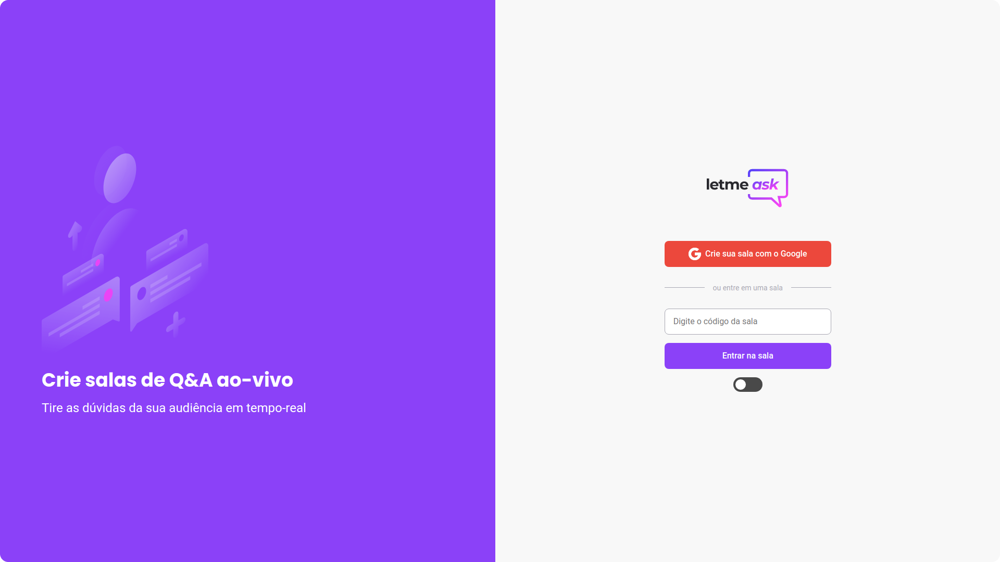
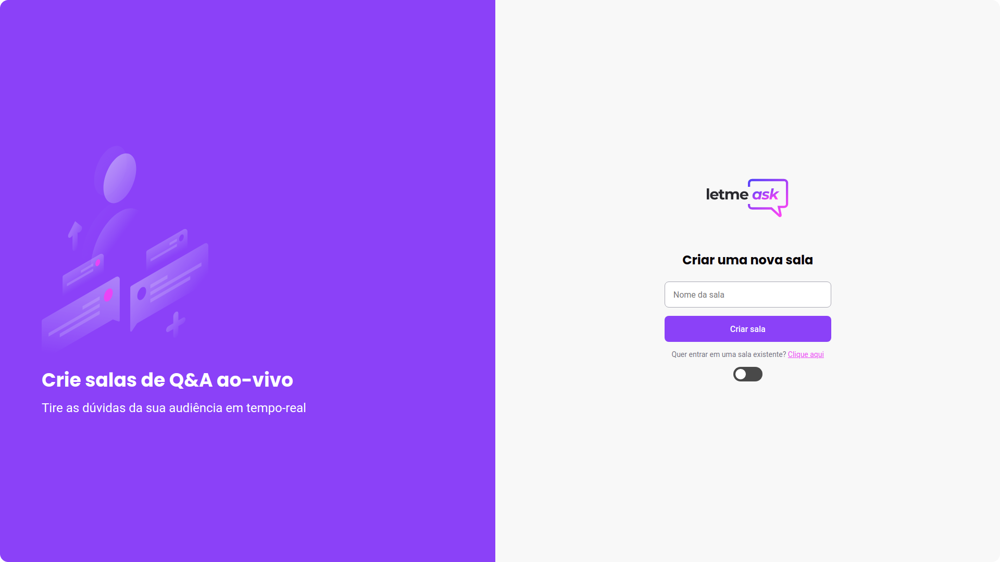
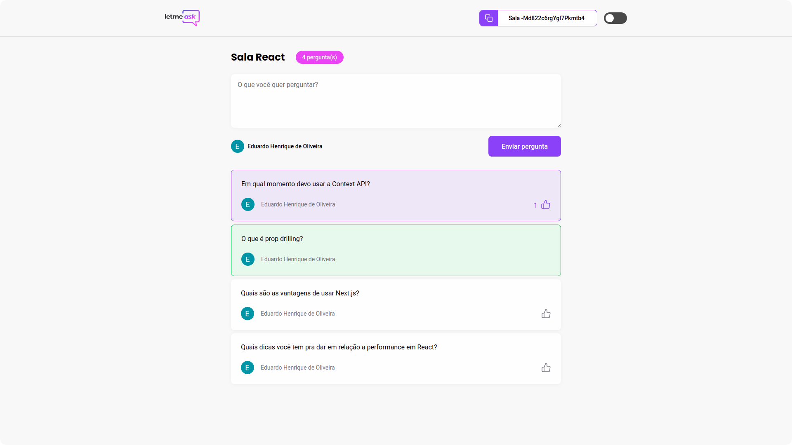

<h1 align="center">
  
</h1>

<p align="center">
  <a href="#technologies">Technologies</a>&nbsp;&nbsp;&nbsp;|&nbsp;&nbsp;&nbsp;
  <a href="#project">Project</a>&nbsp;&nbsp;&nbsp;|&nbsp;&nbsp;&nbsp;
  <a href="#layout">Layout</a>&nbsp;&nbsp;&nbsp;|&nbsp;&nbsp;&nbsp;
  <a href="#usage">Usage</a>
</p>

<h1 align="center">
  
</h1>

## Technologies
This project used the following technologies:

- [React](https://reactjs.org)
- [TypeScript](https://www.typescriptlang.org/)
- [Firebase](https://firebase.google.com/?hl=)
- [Styled Components](https://styled-components.com/)
- [React Toastify](https://fkhadra.github.io/react-toastify/introduction)

## Project
Let me ask it's an app connects curious people to people who have answers. The project was built during the [Next Level Week](https://rocketseat.com.br/) event.

## Layout
Here are some screenshots of the project

### Home
<h1 align="center">
  
</h1>

### New Room
<h1 align="center">
  
</h1>

### Room
<h1 align="center">
  
</h1>

## Usage
You can acess the deployed version of the project here: [https://let-me-ask-react.web.app/](https://let-me-ask-react.web.app/)<br>

In case you want the clone this project, you will need to follow these steps:

### 1 - Install dependencies
Install all the projects dependencies by running `yarn`.

### 2 - Configure your firebase project
In this step you'll have to configure a project in Firebase and set the environment variables inside the `.env.local` file. Here is the structure that you need to have inside of your `.env.local`:

```javascript
REACT_APP_API_KEY="YOUR_API_KEY"
REACT_APP_AUTH_DOMAIN="YOUR_AUTH_DOMAIN"
REACT_APP_DATABASE_URL="YOUR_DATABASE_URL"
REACT_APP_PROJECT_ID="YOUR_PROJECT_ID"
REACT_APP_STORAGE_BUCKET="YOUR_STORAGE_BUCKET"
REACT_APP_MESSAGING_SENDER_ID="YOUR_MESSAGING_SENDER_ID"
REACT_APP_APP_ID="YOUR_APP_ID"
REACT_APP_MEASUREMENT_ID="YOUR_MEASUREMENT_ID"
```

### 3 - Run the project
You can run the project with the `yarn start` command.